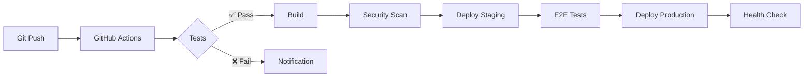

# 🏗️ Document d'Architecture Technique (DAT)
## Projet Cyna - Plateforme de Cybersécurité pour PME et MSP

---

### 📋 **Informations Générales**
- **Projet :** Cyna - Plateforme de cybersécurité pour PME et MSP
- **Version :** 2.0.0
- **Framework :** Next.js 15.3.3 avec App Router
- **Base de données :** PostgreSQL (avec fallback SQLite pour développement)
- **Authentification :** NextAuth.js v5
- **Date de création :** Janvier 2025
- **Équipe :** Équipe Projet Fil Rouge CPI

---

## 🎯 **1. Vision et Objectifs de l'Architecture**

### **Objectif Principal**
Créer une architecture modulaire, évolutive et résiliente qui supporte les objectifs techniques et fonctionnels du projet, tout en assurant une performance optimale, une sécurité renforcée et une évolutivité à long terme pour une plateforme de cybersécurité destinée aux PME et MSP.

### **Vision Stratégique**
Bâtir une architecture microservices modulaire qui permet :
- **Intégration facile** avec des systèmes tiers de cybersécurité
- **Haute disponibilité** (99.9% uptime minimum)
- **Récupération rapide** en cas de panne (RTO < 15 minutes)
- **Facilité de maintenance** et déploiements zero-downtime
- **Conformité RGPD** native et sécurité by-design

### **Objectifs Techniques Spécifiques**
1. **Sécurité Maximale** : Implémentation des standards de cybersécurité (ISO 27001, NIST)
2. **Scalabilité Horizontale** : Capacité à gérer 10 000+ utilisateurs simultanés
3. **Performance** : Temps de réponse < 200ms pour 95% des requêtes
4. **Résilience** : Zero single point of failure
5. **Observabilité** : Monitoring et logging complets

---

## 🏛️ **2. Approche Modulaire et Évolutive**

### **Architecture Microservices**
L'application est conçue selon une architecture modulaire avec des services indépendants :

#### **Services Métier**
- **Service d'Authentification** : Gestion des utilisateurs, OAuth, MFA
- **Service de Contact/Booking** : Gestion des demandes client
- **Service de Contenu** : Blog, documentation, études de cas
- **Service E-Commerce** : Gestion des services, plans, commandes
- **Service de Paiement** : Intégration Stripe, facturation
- **Service RGPD** : Consentements, export de données, suppression

#### **Services Techniques**
- **Service de Notification** : Emails, alertes
- **Service de Monitoring** : Logs, métriques, alertes
- **Service de Cache** : Optimisation des performances
- **Service de Sécurité** : WAF, détection d'intrusion

### **API-First Strategy**
- Toutes les communications passent par des API REST standardisées
- Documentation OpenAPI/Swagger automatique
- Versioning des API (v1, v2) pour la rétrocompatibilité
- Rate limiting et throttling intégrés

---

## ☁️ **3. Stratégie Cloud-First**

### **Architecture Cloud Hybride**
```
┌─────────────────────────────────────────────────────────┐
│                    CLOUD PUBLIC                        │
│  ┌─────────────────────────────────────────────────┐   │
│  │              VERCEL (Frontend)                  │   │
│  │  - Next.js App Router                          │   │
│  │  - CDN Global                                  │   │
│  │  - Edge Functions                              │   │
│  └─────────────────────────────────────────────────┘   │
│                                                         │
│  ┌─────────────────────────────────────────────────┐   │
│  │           NEON/SUPABASE (Database)              │   │
│  │  - PostgreSQL Managed                          │   │
│  │  - Automatic Backups                           │   │
│  │  - Connection Pooling                          │   │
│  └─────────────────────────────────────────────────┘   │
└─────────────────────────────────────────────────────────┘
```

### **Conteneurisation et Orchestration**
- **Docker** : Encapsulation des services en conteneurs
- **Docker Compose** : Orchestration locale pour développement
- **Kubernetes** : Orchestration production (via cloud providers)
- **Helm Charts** : Gestion des déploiements Kubernetes

### **Infrastructure as Code (IaC)**
- **Terraform** : Provisioning de l'infrastructure cloud
- **GitHub Actions** : CI/CD automatisé
- **Configuration** : Variables d'environnement centralisées

---

## 🔒 **4. Sécurité et Résilience Intégrées**

### **Sécurité by Design**

#### **Authentification et Autorisation**
- **NextAuth.js v5** avec providers OAuth (Google, Microsoft)
- **JWT** avec rotation automatique des tokens
- **MFA** (Multi-Factor Authentication) via TOTP
- **RBAC** (Role-Based Access Control) granulaire

#### **Protection des Données**
- **Chiffrement** : TLS 1.3 en transit, AES-256 au repos
- **Hachage** : bcryptjs pour les mots de passe
- **Validation** : Zod pour tous les inputs utilisateur
- **Sanitisation** : Protection XSS, SQL injection

#### **Headers de Sécurité**
```typescript
// Configuration Next.js
{
  'X-Frame-Options': 'DENY',
  'X-Content-Type-Options': 'nosniff',
  'Referrer-Policy': 'strict-origin-when-cross-origin',
  'Content-Security-Policy': 'default-src \'self\'',
  'Strict-Transport-Security': 'max-age=31536000'
}
```

### **Stratégie de Résilience**

#### **Redondance et Haute Disponibilité**
- **Load Balancing** : Répartition de charge automatique
- **Database Clustering** : Réplicas PostgreSQL multi-zones
- **CDN Global** : Distribution mondiale du contenu statique
- **Failover Automatique** : Basculement sans interruption

#### **Sauvegarde et Récupération**
- **Backups Automatiques** : Quotidiens avec rétention 30 jours
- **Point-in-Time Recovery** : Restauration à n'importe quel moment
- **Tests de Récupération** : Validation mensuelle des procédures
- **RTO** : Recovery Time Objective < 15 minutes
- **RPO** : Recovery Point Objective < 1 heure

---

## ⚡ **5. Stratégie d'Optimisation des Performances**

### **Scalabilité Horizontale et Verticale**

#### **Frontend (Next.js)**
- **Static Site Generation (SSG)** : Pages statiques pré-générées
- **Incremental Static Regeneration (ISR)** : Mise à jour incrémentale
- **Server-Side Rendering (SSR)** : Rendu côté serveur optimisé
- **Edge Functions** : Traitement au plus près des utilisateurs

#### **Backend et Base de Données**
- **Connection Pooling** : Gestion optimisée des connexions DB
- **Database Indexing** : Index optimisés pour les requêtes fréquentes
- **Query Optimization** : Requêtes Prisma optimisées
- **Auto-scaling** : Augmentation automatique des ressources

### **Caching et CDN**

#### **Stratégie de Cache Multi-Niveaux**
```
┌─────────────────────────────────────────────────────────┐
│                    CACHE LAYERS                        │
│                                                         │
│  ┌─────────────┐  ┌─────────────┐  ┌─────────────┐    │
│  │   Browser   │  │     CDN     │  │  Application │    │
│  │    Cache    │  │    Cache    │  │    Cache     │    │
│  │             │  │             │  │   (Redis)    │    │
│  └─────────────┘  └─────────────┘  └─────────────┘    │
│                                                         │
│  ┌─────────────────────────────────────────────────┐   │
│  │              DATABASE CACHE                     │   │
│  │  - Query Result Caching                        │   │
│  │  - Connection Pooling                          │   │
│  └─────────────────────────────────────────────────┘   │
└─────────────────────────────────────────────────────────┘
```

### **Monitoring et Observabilité**
- **Métriques Temps Réel** : Temps de réponse, throughput, erreurs
- **APM** (Application Performance Monitoring) : Vercel Analytics
- **Logging Centralisé** : Agrégation et analyse des logs
- **Alertes Proactives** : Notification automatique des anomalies

---

## 🔄 **6. Automatisation et DevOps**

### **Pipelines CI/CD**

#### **Architecture GitOps**


#### **Étapes du Pipeline**
1. **Linting & Formatting** : ESLint, Prettier
2. **Tests Unitaires** : Jest, React Testing Library
3. **Tests d'Intégration** : Playwright, Cypress
4. **Security Scanning** : Snyk, CodeQL
5. **Build & Optimization** : Webpack, SWC
6. **Deployment** : Vercel, Docker

### **Tests Automatisés**

#### **Pyramide de Tests**
```
┌─────────────────────────────────┐
│        E2E Tests (10%)          │
│     Integration Tests (20%)     │
│      Unit Tests (70%)           │
└─────────────────────────────────┘
```

#### **Couverture de Tests**
- **Tests Unitaires** : Logique métier, utilitaires
- **Tests d'Intégration** : APIs, base de données
- **Tests E2E** : Parcours utilisateur critiques
- **Couverture Cible** : 80% minimum

### **Infrastructure Automatisée**
- **Provisioning** : Terraform pour infrastructure cloud
- **Configuration** : Ansible pour configuration serveurs
- **Secrets Management** : HashiCorp Vault ou cloud native
- **Monitoring** : Prometheus + Grafana

---

## 📋 **7. Gouvernance et Conformité**

### **Gouvernance des Données**

#### **Conformité RGPD**
- **Consentements Granulaires** : Gestion fine des autorisations
- **Droit à l'Oubli** : Suppression automatisée des données
- **Portabilité** : Export des données utilisateur
- **Rétention** : Politique de conservation 7 ans
- **Audit Trail** : Traçabilité complète des accès

#### **Modèle de Données RGPD**
```sql
-- Consentements utilisateur
model DataProcessingConsent {
  consentType String  -- "marketing", "analytics", "cookies"
  purpose     String  -- Description détaillée
  granted     Boolean
  grantedAt   DateTime?
  revokedAt   DateTime?
  ipAddress   String?
  userAgent   String?
}
```

### **Politiques de Gestion des Accès**

#### **RBAC (Role-Based Access Control)**
```typescript
enum UserRole {
  CLIENT        // Utilisateur standard
  ADMIN         // Administrateur
  SUPER_ADMIN   // Super administrateur
}
```

#### **Permissions Granulaires**
- **Principe du Moindre Privilège** : Accès minimal nécessaire
- **Séparation des Responsabilités** : Aucun utilisateur unique ne peut tout faire
- **Révision Périodique** : Audit trimestriel des accès
- **Gestion des Sessions** : Expiration automatique, déconnexion forcée

### **Gestion des Audits et Journaux**

#### **Logging de Sécurité**
```typescript
model AuthenticationLog {
  event       AuthEventType  // LOGIN_SUCCESS, LOGIN_FAILED, etc.
  userId      String?
  ipAddress   String
  userAgent   String
  location    String?
  details     String?        // JSON avec contexte
  createdAt   DateTime
}
```

#### **Événements Tracés**
- **Authentification** : Connexions, échecs, déconnexions
- **Autorisation** : Accès aux ressources sensibles
- **Modification de Données** : CRUD sur données critiques
- **Administration** : Actions administratives
- **Sécurité** : Tentatives d'intrusion, anomalies

---

## 🚀 **8. Innovation et Agilité**

### **Adaptabilité Technologique**

#### **Veille Technologique Continue**
- **Monitoring des Tendances** : Suivi des technologies émergentes
- **POC Réguliers** : Tests de nouvelles solutions
- **Mise à Jour Planifiée** : Roadmap d'évolution technologique
- **Formation Équipe** : Montée en compétences continue

#### **Technologies Surveillées**
- **IA/ML** : Intégration d'intelligence artificielle
- **Edge Computing** : Traitement en périphérie
- **Blockchain** : Authentification et traçabilité
- **Quantum Computing** : Préparation aux menaces futures

### **Prototypage Rapide**

#### **Environnements de Développement**
- **Dev** : Développement local avec Docker
- **Staging** : Environnement de test complet
- **Preview** : Branches de fonctionnalités (Vercel)
- **Production** : Environnement de production

#### **Méthodologie Agile**
- **Sprints** : Cycles de développement 2 semaines
- **Continuous Delivery** : Déploiements fréquents
- **Feature Flags** : Activation/désactivation de fonctionnalités
- **A/B Testing** : Tests utilisateur en continu

---

## 📊 **9. Métriques et KPI**

### **KPI Techniques**
- **Disponibilité** : 99.9% uptime
- **Performance** : < 200ms temps de réponse
- **Sécurité** : 0 incident critique
- **Qualité** : 80% couverture de tests

### **KPI Métier**
- **Utilisateurs Actifs** : Croissance mensuelle
- **Conversion** : Taux de transformation visiteur → client
- **Satisfaction** : NPS (Net Promoter Score)
- **Rétention** : Taux de fidélisation client

---

*Document d'Architecture Technique v2.0 - Projet Cyna*
*Dernière mise à jour : Janvier 2025*
